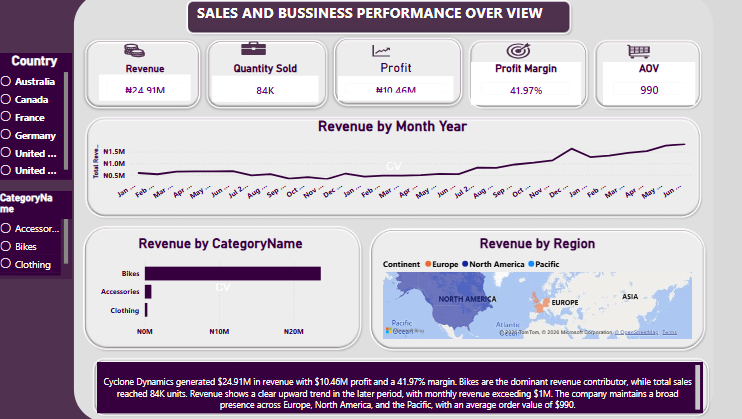

# Cyclone Dynamics Sales Performance Dashboard

## Project Overview

Developed an interactive Power BI dashboard for Cyclone Dynamics to monitor revenue, quantity sold, profit, profit margin, and average order value.

## Objectives

* Monitor key business performance indicators
* Analyze revenue trends over time
* Identify the highest-performing product categories
* Understand regional business performance
* Support data-driven business decisions

## Tools Used

* Power BI
* Power Query
* DAX
* Data Modelling

## Key Insights

* Total revenue reached approximately 24.91 million.
* Total quantity sold was approximately 84 thousand units.
* Total profit was approximately 10.46 million.
* Profit margin was approximately 41.97%.
* Bikes were the leading revenue-generating product category.
* Revenue showed an upward trend toward the later period.
* The business had sales presence across Europe, North America, and the Pacific region.

## Dashboard Preview

## Project Files

* Power BI dashboard file
* Dashboard preview image
* Project documentation

## Author

Chisom Nancy Joseph

